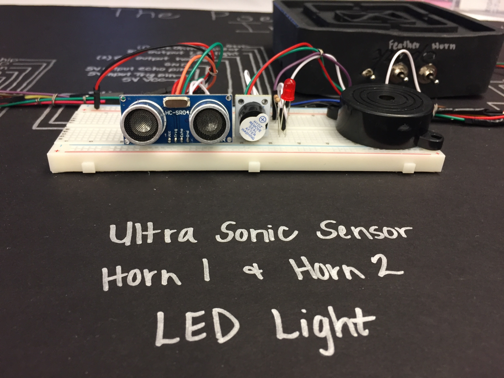
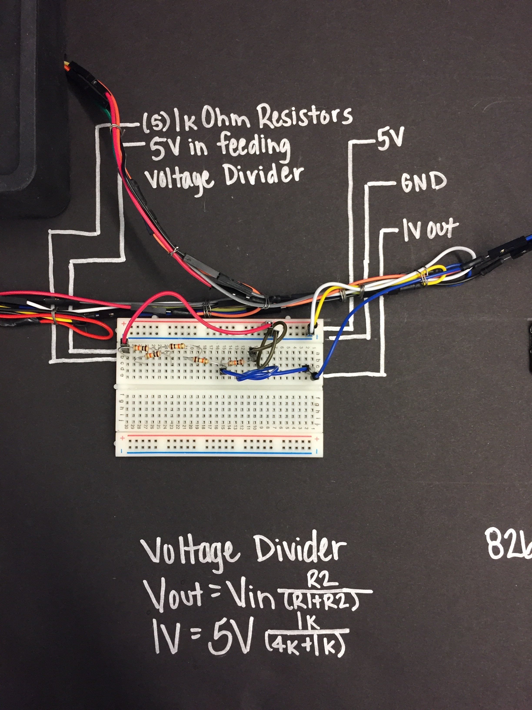
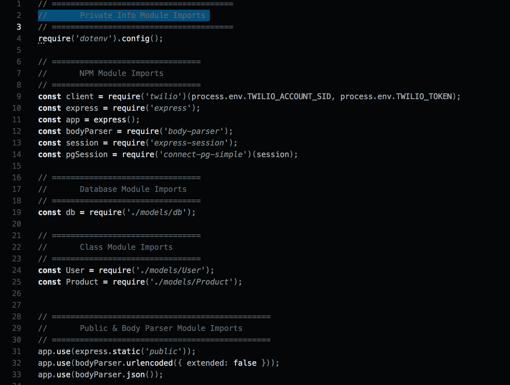
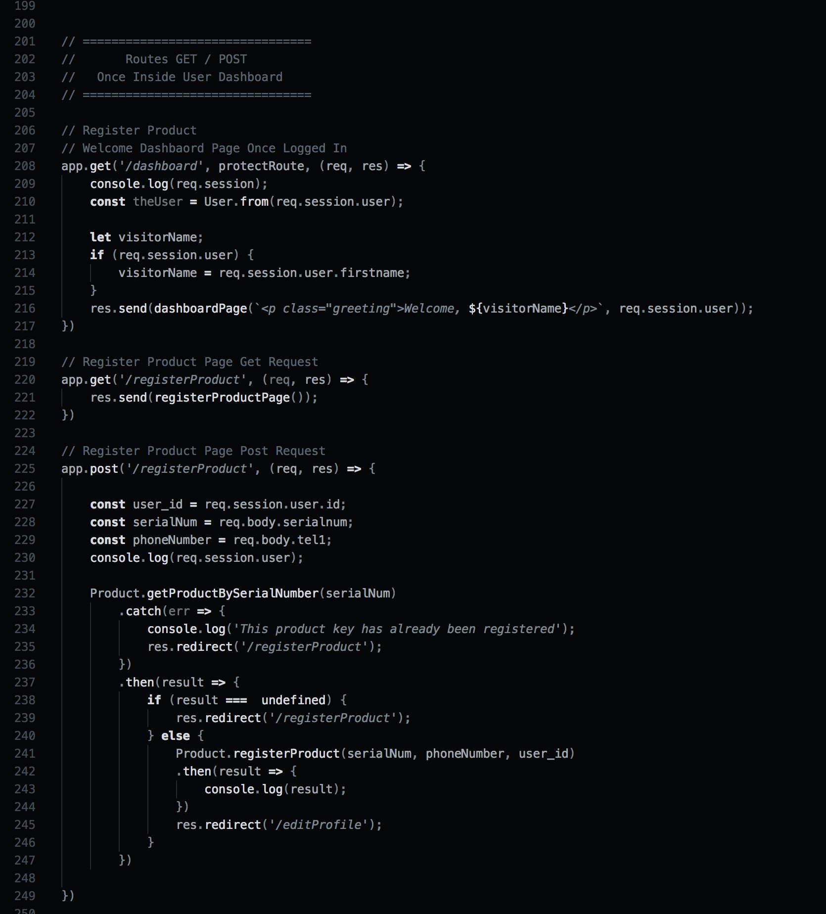
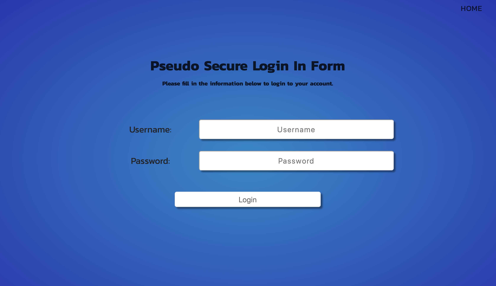

# The Pseudo Secure Initiative

## Live Demo Coming Soon
---

## What Is The Pseudo Secure Initiative and Why Was It Built
The Pseduo Secure Initiative is an app prototype I decided to build for my final project while attending Digital Crafts; 
a 16 week full-time, immersive coding boot camp. After having my car broken into the alarm was damaged and disabled. 
Because of this event, it caused me to become more aware of how prevalent burglary and petty theft really are and how 
expensive security systems can become. This inspired me to build a portable sensor that would notify a user with a text 
message when motion is detected. The goal is to lower the cost of installation fees associated with wiring harnesses in 
vehicles; aiming to create a temporary, inexpensive solution for those in need of a more affordable alternative. The total 
after having a new baseline alarm system installed in my car was $350. This prototype design, however currently costs $25 
wholesale to build and does not require a specialist to install into a vehicle and can be used inside a home or anywhere 
with access to a wifi connection. This is the process I went through to build this system and what I learned along the way. 
This project was built for educational purposes.

## Technologies used
* C++
* Arduino
* JavaScript
* Nodejs
* PostgreSQL
* HTML 
* CSS Flexbox

## Process Build, Challenges, and Site Walkthrough

### Planning
Without a background in C++ or Arduino my first day was spent watching tutorials to learn about the anatomy of the Arduino and basic C++ syntax pertaining to Arduino. The first step was to learn how to do basic tasks such as make an LED blink, understand power source requirements throughout the board, and the differences in capability between digital and analog I/O pins, along with some basic terminology. This foundational knowledge gave me the ability to think about how I wanted to design the circuit. Luckily, I had spent the last two and half years working as an industrial electrician wiring I/O circuits on programming logic controllers (PLC's) with Seimens, Sick, Allen Bradley and various other uncommon electrical devices. I also had never programmed a logic controller or designed an electrical circuit from scratch as the engineers I worked with developed the schmatics and wrote the programs for these devices. My job was to understand the schematics and install the devices accordingly. It was very different and truly engaging to be able to wear a different hat in building this project.
<p>Ariel Photo of Prototype</p>
<p align='center'>
    </img>
</p>
<br>

### Giving Power to the Super Sonic Sensor, LED, and Horns
Once I was able to identify and name all the parts needed to build this project, I began with powering the Ultra Sonic Sensor. I provided 5v power from the Arduino to the sensor along with a ground. The sensor also required two signal wires, an input, and an output. There are two parts to this sensor; a transmitter and receiver. The transmitter emits a high pitched frequency inaudible to most humans and is responsible for sending the frequency that rebounds and travels back to the receiver. Based on the amount of time that elapses, we can calculate the approximate distance of the obstruction. We can use this change in state to determine that there has been an intruder or interference. The sensor has a range of up to 13 feet. 
<br>
I also wanted to be able to have a horn sound and light triggered as outputs from the Arduino but only once something has passed in front of the sensor. The LED takes a 220k Ohm resistor in series to lower the current coming in so we don't destroy the LED as this LED only need .20amps of voltage to be powered. The horn, however, needed 5v as an output which I was able to get from the Arduino. The reason we want the LED and the HORN to be outputs rather than plug them directly to 5v is the light and horn would always be on as opposed to when the Arduino fires it on when a certain condition is met. Simple C++ conditionals gave me the ability to write logic statements that could be evaluated.
<p>Photo of Super Sonic Sensor, LED, and Horn</p>
<p align='center'>
    </img>
</p>
<br>

### Powering the 8266 Wifi chip, downloading the drivers and libraries
This process took a lot of time for me get working because I wasn't aware I needed libraries and drivers for the chip to work. I knew the chip needed 3.3 volts to be powered, as well as a ground. The Arduino also has a spot for 3.3v, but I read online that sometimes pulling power from the 3.3v causes issues with the wifi chip working consistently. This caused me to build a voltage regulator with an input of 5v from the Arduino and an output of 3.3v with a 1uf capacitor and .01cf capacitor in series. This did work but I also tried powering the wifi chip from the 3.3v directly and never experienced any powering issues so I removed the voltage regulator from the circuit. Next, I needed the appropriate drivers, and libraries to get the chip in working order. I read and reread the documentation for several hours and experimented until I was able to upload a simple blink program. Once I knew I could do that I knew I could upload a more complex program.
<br>
<p>Photo of 8266 Wifi Chip</p>
<p align='center'>
    </img>
</p>

### Voltage Dividing and powering the 8266 wifi-chip ADC pin
This next step was the most difficult for me in designing this circuit. The challenge was to fire an output to a pin on the wifi chip and to read the digital value of the pin. If the value is LOW do nothing because there is no voltage applied and if their value is HIGH trigger the route that will allow us to be notified of movement. This, however, did not work and after another day of digging I received a tip from my teacher to maybe consider reading analog value rather than digital. It was this tip that allowed me to look deeper in this direction and realize the specific chip I had could not do digital reads on their GPIO pins. The internal pull-down and pull-up resistor prevent you from being able to change and read the state on the fly. There were almost 20 variations of the 8266 wifi chip each with certain capabilities and restrictions adding to the complexity of what and what not to do. I finally narrowed it down to the ADC pin which could read analog values the only catch was it was 1v compatible apart from the rest of the chip that was 3.3 volt compatible. So if there was voltage applied the value read would be between 0 and 1024. If all goes well when voltage closer to a full 1v is applied your ADC pin should read 1024 and anything less than 1v should continuously be less than 1024. For example, if you have applied .5v than your analog value could read as 500. It won't be exact each time but perfect for what I needed to do. 
<br>
<p>Photo of Voltage Divider</p>
<p align='center'>
    </img>
</p>

### Glimpse into the Arduino 8266 Wifi Chip C++ Code
So, here we have a few library imports that allow the wifi chip to access a wifi connection. We enter the name of the wifi network along with the password. Once the wifi connection is made we set up a post request to localhost 3000 including our IP Address. On the other end, I have Express listening for requests on localhost 3000. If the connection was successful we will get a message in JSON letting us know we are connected to the wifi network. From there we compare our analog read value to its prior state. If no one has crossed in front of the sensor then the analog read value will be very low(less than 850). However, once someone has crossed in front of the sensor the voltage on the ADC pin will be 1v(an output from pin 8 on the Arduino) changing the analog read value to 1024. We evaluate this condition in a loop so that we know when the analog value becomes 1v. This value will be above 850 and will trigger a different post request that express is listening for, letting us know that the alarm has been triggered.

```

    #include <SoftwareSerial.h>
    
    #include <ESP8266HTTPClient.h>
    #include <ESP8266WiFi.h>
    
    const char* ssid = "atltechvillage";
    const char* password = "beniceanddreambig";
    
    HTTPClient http;
    
    void setup() {
      Serial.begin(115200);
      pinMode(LED_BUILTIN, OUTPUT);
      
      WiFi.begin(ssid, password);
    
      while(WiFi.status() != WL_CONNECTED) {
        delay(100);
        Serial.println("Waiting for connection");
      }
      
    }
    
    void loop() {

        int adcvalue = analogRead(A0);
    
      if (WiFi.status() == WL_CONNECTED) {
        
            Serial.println("Connected to wifi network");
    
            http.begin("http://10.150.11.75:3000/");
            http.addHeader("Content-Type", "application/x-www-form-urlencoded");
            
            int httpCode = http.POST("success=Wifi Network is connected");
            String payload = http.getString();
            Serial.print(payload);
            Serial.print(payload);
            Serial.print(payload);
            Serial.print(payload);
            
            http.end();
            
        } else {
            Serial.println("Error in Wifi connection"); 
        }
     
        if (adcvalue > 850) {
              Serial.println("Intruder detected. Please check your belongings.");
              Serial.print("My current analog value value is ");
              Serial.println(adcvalue);
              http.begin("http://10.150.11.75:3000/intruder");
              http.addHeader("Content-Type", "application/x-www-form-urlencoded");
              int httpCode = http.POST("Intruder=Someone has triggered the alarm. Please check valuables: hello");
              String payload = http.getString();
              http.end();
          } else if (adcvalue < 850) {
            Serial.println("System is armed");
            Serial.print("My adc value is ");
            Serial.println(adcvalue);
          } 
          
        delay(1000);
     
    }
    

```

<br>

### Glimpse into the Nodejs and Twilio Backend Code

```
// =======================================
//       Intruder GET / POST Requests
// =======================================

app.post('/', (req, res) => {
    console.log(req.body);
    res.send(
        "Looks like you are posting to local host 3000"
    );
})

app.post('/intruder', (req, res) => {
    console.log(req.body);
    client.messages
    .create({
        body: 'Intruder detected. Please check your personal belongings.',
        from: '+15709191853',
        to: '+18622791359'
    })
    .then(message => console.log(message.sid))
    .done();

    // client.messages
    // .create({
    //     body: 'Intruder detected again. Please check your personal belongings.',
    //     from: '+15709191853',
    //     to: '+14235822300'
    // })
    // .then(message => console.log(message.sid))
    // .done();
})

```

<br>

## Site Walkthrough of App Design and Functionality

<p>Photo of Landing Page</p>
<p align='center'>
    </img>
</p>
<br>

<p>Photo of Node Module Imports to Build Backend Featues</p>
<p align='center'>
    </img>
</p>
<br>

<p>Photo of Sign Up Page</p>
<p align='center'>
    </img>
</p>

<p>Sign up POST request</p>

```
app.post('/signup', (req, res) => {
    const firstname = req.body.firstname;
    const lastname = req.body.lastname;
    const email = req.body.email;
    const username = req.body.username;
    const password = req.body.password;

    console.log("hey this is the form data")
    console.log(req.body)

    User.createUser(firstname, lastname, email, username, password)
        .catch(() => {
            res.redirect('/signup');
        })
        .then(newUser => {
            req.session.user = newUser;
            res.redirect('/dashboard');
            console.log("User has been added");
        });
})
```

<br>

<p>Photo of Dashboard Page</p>
<p align='center'>
    </img>
</p>
<br>

<p>Welcome Dashboard POST request</p>

```
// ================================
//       Routes GET / POST
//   Once Inside User Dashboard
// ================================

// Welcome Dashbaord Page Once Logged In
app.get('/dashboard', protectRoute, (req, res) => {
    console.log(req.session);
    const theUser = User.from(req.session.user);

    let visitorName;
    if (req.session.user) {
        visitorName = req.session.user.firstname;
    }
    res.send(dashboardPage(`<p class="greeting">Welcome, ${visitorName}</p>`, req.session.user));
})
```

<br>

<p>Photo of Nodejs Dashboard</p>
<p align='center'>
    </img>
</p>
<br>

<p>Photo of Login Page</p>
<p align='center'>
    </img>
</p>
<br>

<p>Sign up POST request</p>

```
app.post('/login', (req, res) => {

    console.log(req.body);
    const username = req.body.username;
    const thePassword = req.body.password;

        User.getUserByUsername(username)
            .catch(err => {
                console.log('There was an error retriving you info');
                res.redirect('/login');
            })
            .then(result => {
                if (result.passwordDoesMatch(thePassword)) {
                    req.session.user = result;
                    res.redirect('/dashboard');
                } else {
                    res.redirect('/login');
                }
            })
})
```

<br>

<p>Photo of Register Product Page</p>
<p align='center'>
    </img>
</p>
<br>

<p>Register Product POST request</p>

```
app.post('/registerProduct', (req, res) => {
    
    const user_id = req.session.user.id;
    const serialNum = req.body.serialnum;
    const phoneNumber = req.body.tel1;
    console.log(req.session.user);

    Product.getProductBySerialNumber(serialNum)
        .catch(err => {
            console.log('This product key has already been registered');
            res.redirect('/registerProduct');
        })
        .then(result => {
            if (result ===  undefined) {
                res.redirect('/registerProduct');
            } else {
                Product.registerProduct(serialNum, phoneNumber, user_id)
                .then(result => {
                    console.log(result);
                })
                res.redirect('/editProfile');
            }
        })
    
})
```

<br>

<p>Photo Nodejs Register Product Page</p>
<p align='center'>
    </img>
</p>
<br>


### Future Goals and Added Features
* Incorporate a range extender for those whose wifi connection may not allow the sensor to be useful outdoors, such as in a driveway or garage. 
<br>

* Eliminate the need for a wifi-connection altogether and create an alternative to long distance security options where wifi isn't available, such as a public parking lot or with street parking outside a wifi range. 
<br>

* Expand on the back end functionality and make the user experience more fluid, pertaining to registering a product and product support. 
<br>

* Add additional sensors to widen the range of the sensor to be 45 degrees with 3 sensors as opposed to only 1 with a 15-degree view. <br>
<br>
I appreciate the time taken to view this project and all feedback and suggestions are welcomed. Feel free to reach me by email at antdevelopment1@gmail.com, linkedIn at https://www.linkedin.com/in/april-copes/ or view my github profile at https://github.com/antdevelopment1.
       


